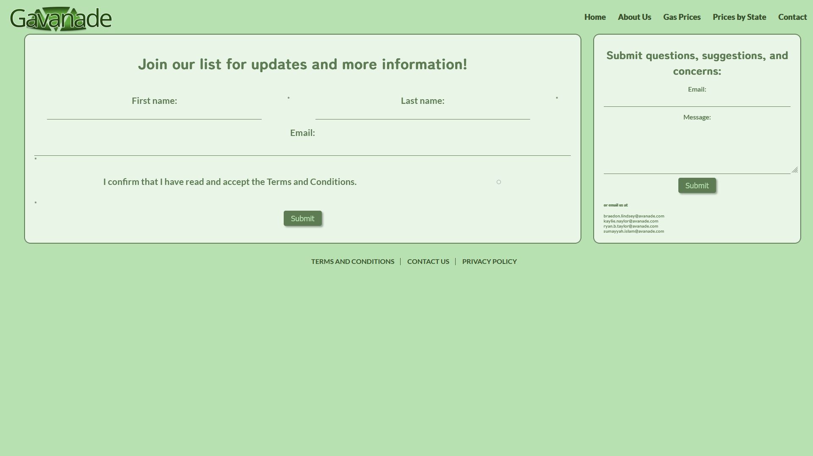

# Intern Project

This project is a website that allows users to find the average gas price in a specific location in the U.S. and compare the gas prices based on states. It also puts our knowledge of Azure services to use!

  

-   [Meet The Interns](#about-us)
-   [Using the Website](#using-the-website)
    -   [Search by Zipcode](#searching-by-zipcode)
    -   [Searching by Map](#searching-by-map)
    -   [Prices by State](#prices-by-state)

<!-- -   [How it works](#using-the-website) -->
<!--     -   [Azure](#searching-by-zipcode) -->
<!--     -   [Flask](#prices-by-state) -->
<!--     -   [Azure Functions](#searching-by-map) -->

-   [Contact Page](#contact-page)

# About Us

This project was put together by 4 interns. Kaylie Naylor and Sumayyah Islam were the front-end developers for this project while Braedon Lindsey and myself (Ryan Taylor) were the back-end developers for this project. The about us page provides a little bit of background information about each of us.

  

# Using the Website

## Searching by Zipcode

The **Zipcode** page allows users to input any **US** zipcode and receive:

-   the average gas price for the **given zipcode**
-   the average gas price for the **state that zipcode is in**
-   the national average gas price for the **US**

The user is also provided with the state and national average gas prices based on the data in our azure SQL database which updates prices automatically every Sunday at midnight.

https://user-images.githubusercontent.com/65800865/182936857-93442f45-97e1-4d83-974d-d3bbba21cbf5.mp4

## Searching by Map

The **Map** page allows users to click anywhere within the US and **drop a pin** to get information. Users can **pan and zoom** to get to the precise location desired. The information mirrors that provided by the zipcode page.

https://user-images.githubusercontent.com/65800865/182935891-48a47cc2-3598-4344-9ec4-af041ae2c7fd.mp4

## Prices by State

The **State Prices** page allows users to see today's average state gas prices for **every US state plus Washington DC**.
Users can **sort** a page in ascending or descending order either **alphabetically** or **by price** by clicking the label at the top of a column.

https://user-images.githubusercontent.com/65800865/182937123-0e99c2ae-6239-4626-9b96-300f73767b4e.mp4

# Contact Page

The **Contact Us** page allows users to input their name and email to **sign up to an email list**. Users can also **submit questions, suggestions, or concerns.** This information is **submitted to our azure SQL database.**

  

