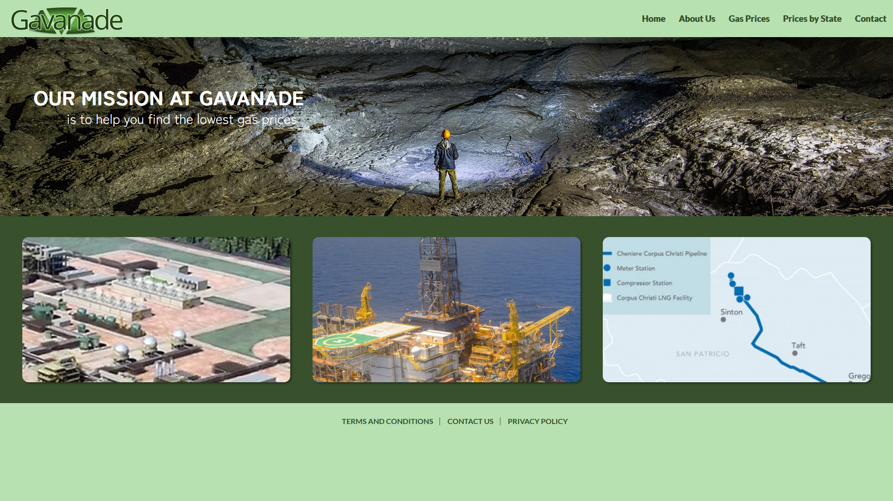

# Avanade Intern Project (Gavanade)

This project is a website that allows users to find the average gas price in a specific location in the U.S. and compare the gas prices based on states. It also puts our knowledge of Azure services to use!

<p align="center">
  
</p>

-   [Meet The Interns](#about-us)
-   [Features](#features)
-   [Getting started](#getting-started)
    -   [Installation](#installation)
        -   [Important note about versioning](#important-note-about-versioning)
        -   [Using vim-plug](#using-vim-plug)
        -   [Using packer](#using-packer)
        -   [Nightly users](#nightly-users)
-   [Usage](#usage)
-   [Keybindings](#keybindings)
-   [Contact Page](#contact-page)

https://user-images.githubusercontent.com/65800865/182935891-48a47cc2-3598-4344-9ec4-af041ae2c7fd.mp4

# About Us

# Features

# Getting started

## Installation

### Important note about versioning

### Using vim-plug

```vim
Plug 'phaazon/hop.nvim'
```

### Using packer

### Nightly users

# Usage

# Contact Page
